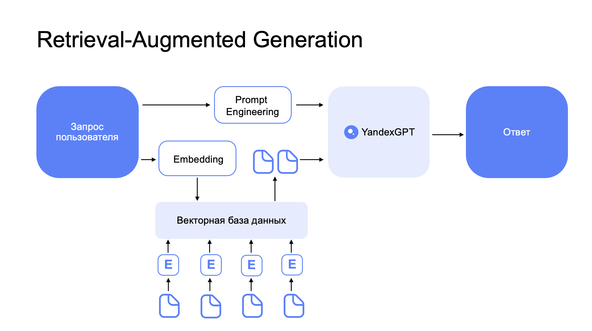

# Retrieval-augmented generation in Yandex Cloud services

You can use YandexGPT to implement scenarios for answering questions on documentation, regulatory policies, knowledge bases, etc. We recommend employing retrieval-augmented generation, so that the model can help you based on a relevant corpus of documents rather than just the data it was trained on.

## How it works:
1. A knowledge base (collection of documents) is split into fragments (chunks) for YandexGPT to vectorize. These representations (_embeddings_) are stored in a vector database, e.g., OpenSearch, ChromaDB, or LanceDB.
1. A user sends a text query to the system.
1. YandexGPT vectorizes the query. 
1. The vector database is searched for chunks closest to the user’s query. Depending on chunk size, top _n_ most relevant documents are selected.
1. These documents, the user query, and task statement (prompt) are provided to YandexGPT, which generates a final response to return to the user. 

In this guide, we will use the following Yandex Cloud services to demo the this scenario:
1. [YandexGPT](https://cloud.yandex.ru/docs/yandexgpt/): Large language model for creating document embeddings and answering questions.
1. [Yandex Managed Service for OpenSearch](https://cloud.yandex.ru/docs/managed-opensearch/): Service for managing OpenSearch clusters. We will use this to store pairs of document chunks and vector representations of those chunks.
1. [Yandex Object Storage](https://cloud.yandex.ru/docs/storage/): Object storage where the knowledge base files are initially stored. 
1. [Yandex DataSphere](https://cloud.yandex.ru/docs/datasphere/): Python IDE to train ML models and work with YandexGPT and OpenSearch.

The vector database and YandexGPT will be managed with [LangChain](https://www.langchain.com/), a popular open-source framework. 

For detailed comments on working with the components, see the project files (we recommend you open them in [Yandex DataSphere](https://cloud.yandex.ru/services/datasphere)).

## Step-by-step guide

1. Go to [OpenSearch](https://cloud.yandex.ru/services/managed-opensearch) and create a cluster as per [this guide](https://cloud.yandex.ru/docs/managed-opensearch/operations/cluster-create). Create a group of OpenSearch hosts and a group of virtual dashboard hosts. The OpenSearch cluster, Object Storage, and DataSphere must be on the same subnet, e.g., default-ru-central1-a.
1. Go to [Yandex Object Storage](https://cloud.yandex.ru/docs/storage/) and create a new bucket. Upload the documents to answer questions on to this bucket.  
1. Go to [Yandex DataSphere](https://cloud.yandex.ru/services/datasphere) and create a [community](https://cloud.yandex.ru/docs/datasphere/operations/community/create) and [project](https://cloud.yandex.ru/docs/datasphere/operations/projects/create) to run Python code in. 
1. In the DataSphere project, create a [connector](https://cloud.yandex.ru/docs/datasphere/operations/data/s3-connectors) to Object Storage S3. Activate the connector for JupyterLab. 
1. In the created project, go to the **Settings** tab and specify:
- `Default folder`: Folder where you created your Yandex Managed Service for OpenSearch and YandexGPT services.
- `Service account`: [Service account](https://cloud.yandex.ru/docs/iam/quickstart-sa) to access other services from your DataSphere project. The service account must be assigned the following roles: *ai.languageModels.user* to access the YandexGPT model, *managed-opensearch.admin* to work with OpenSearch, and *vpc.user*.
- `Subnet`: Specify the subnet where OpenSearch and YandexGPT services are located.
1. Open your project in JupyterLab and clone this repository with [Git](https://cloud.yandex.ru/docs/datasphere/operations/projects/work-with-git). We recommend that you use _dedicated_ mode when launching it. 
1. In your project, open the [YandexGPT_OpenSearch.ipynb](YandexGPT_OpenSearch.ipynb) notebook and run all the code cells.

## Key steps in the `YandexGPT_OpenSearch` notebook
1. Documents from the object storage are split into small fragments (chunks) of this size: `chunk_size`. Make sure to define `chunk_size` with these factors in mind:
    * Allowable context length for the embedding model. Yandex GPT embeddings support 2,048 tokens.
    * Allowable size of the LLM context window. If we want to use the top 3 search results in a query, then `3*chunk_size+prompt_size+response_size` must not exceed the model’s context length.
1. Next, with the Yandex GPT Embedding API, we generate vector embeddings from our text chunks. For the adapter to handle embeddings and the YandexGPT model, refer to [YaGPT.py](YaGPT.py).
1. We add the obtained vectors to OpenSearch.
1. We test whether chunks returned for a query are relevant.
1. We shape the retrieval-augmented generation pipeline and verify that it works correctly.
